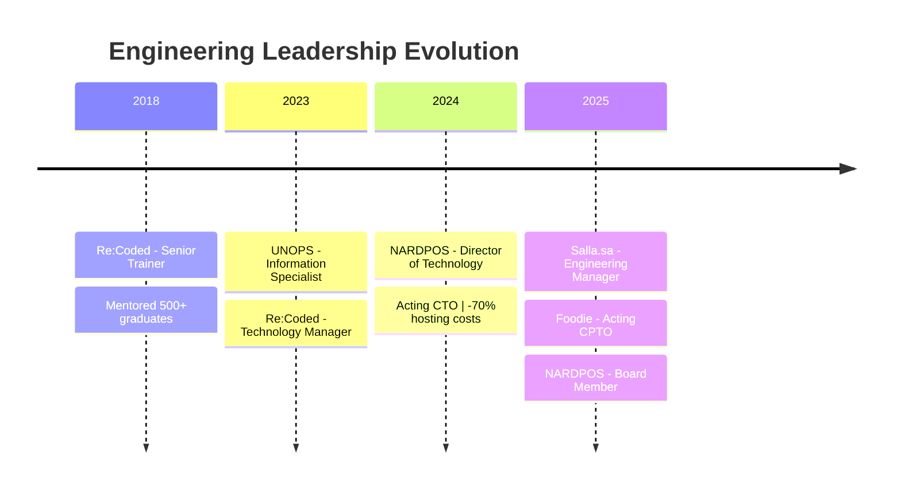

<div align="center">

<!-- Animated Header -->


<!-- Animated Typing -->
<a href="https://git.io/typing-svg"></a>

<!-- Social Badges -->
<p>
  <a href="https://www.linkedin.com/in/maheralaqil/">
    
  </a>
  <a href="https://medium.com/@maqalaqil">
    
  </a>
  <a href="https://instagram.com/maqalaqil">
    
  </a>
  <a href="https://discord.gg/maqalaqil">
    
  </a>
  <a href="mailto:Maheralaqil@gmail.com">
    
  </a>
</p>

<!-- Location & Profile Views -->


</div>

---

<!-- About Section -->


## 🧑‍💻 About Me

Engineering leader with **10+ years** of experience in solution architecture and innovation strategy. I specialize in building high-performing engineering teams and delivering digital transformation at scale.

### 🏆 Key Achievements

| Metric | Impact |
|--------|--------|
| 📈 Engineering Efficiency | **+40%** |
| 💰 Hosting Cost Reduction | **-70%** |
| ⚡ System Uptime | **99.9%** |
| 🎓 Developers Mentored | **500+** across 5 countries |
| 🌍 Markets Scaled | MENA & GCC regions |

<br clear="right"/>

---

## 💼 Current Roles

<table>
<tr>
<td width="50%">

### 🍽️ Acting CPTO @ Foodie
**2025 - Present** | UAE (Remote)

Next-gen food discovery platform connecting restaurants, creators & customers.
- Led full technical strategy & engineering organization
- Established foundation enabling rapid product evolution
- Built high-velocity engineering culture across all teams

</td>
<td width="50%">

### 🛒 Engineering Manager @ Salla.sa
**2025 - Present** | KSA (Remote)

Leading e-commerce platform in Saudi Arabia.
- Driving expansion into international markets
- Leading 7-10 cross-functional engineers & QA
- Implemented MCP & design system (+40% efficiency)

</td>
</tr>
</table>

---

## 🚀 Career Journey



<details>
<summary><b>📜 Full Experience Timeline</b></summary>
<br/>

| Role | Company | Period | Key Impact |
|------|---------|--------|------------|
| **Acting CPTO** | Foodie | 2025+ | Technical vision & engineering leadership |
| **Engineering Manager** | Salla.sa | 2025+ | GCC expansion, +40% engineering efficiency |
| **Board Member** | NARDPOS | 2025+ | Strategic technology advisory |
| **Director of Technology** | NARDPOS | 2024-2025 | -70% hosting costs, 99.9% uptime |
| **Technology Manager** | Re:Coded | 2023-2024 | +30% enrollment, -40% downtime |
| **Information Specialist** | UNOPS | 2023+ | -90% report time, data optimization |
| **Lead Trainer** | Re:Coded | 2018-2023 | 500+ graduates mentored |

</details>

---

## ⚡ What I Bring

```javascript
const maher = {
    title: "Tech Lead | Solution Architect | Engineering Manager",
    location: "California, USA 🇺🇸",
    
    expertise: {
        architecture: ["Microservices", "Event-Driven", "Cloud-Native", "Distributed Systems"],
        leadership: ["Team Building", "Technical Strategy", "Digital Transformation"],
        methodologies: ["Agile", "DevOps", "CI/CD", "Platform Engineering"]
    },
    
    currentFocus: [
        "Scaling engineering teams globally",
        "Cloud infrastructure optimization",
        "AI/ML integration in products"
    ],
    
    impact: {
        engineeringEfficiency: "+40%",
        costReduction: "-70%",
        uptime: "99.9%",
        developersmentored: "500+"
    }
};
```

---

## 🛠️ Tech Arsenal

<details open>
<summary><b>💻 Languages & Frameworks</b></summary>
<br/>
<p align="center">
  
</p>
</details>

<details open>
<summary><b>🎨 Frontend & Mobile</b></summary>
<br/>
<p align="center">
  
</p>
</details>

<details open>
<summary><b>☁️ Cloud & DevOps</b></summary>
<br/>
<p align="center">
  
</p>
</details>

<details open>
<summary><b>🗄️ Data & Messaging</b></summary>
<br/>
<p align="center">
  
</p>
</details>

<details open>
<summary><b>🤖 AI/ML & Tools</b></summary>
<br/>
<p align="center">
  
</p>
</details>

---

## 🎓 Certifications

<div align="center">

| Certificate | Issuer |
|-------------|--------|
| 🧠 **Neural Networks and Deep Learning** | DeepLearning.AI |
| 📊 **Foundations of Project Management** | Google |
| 🏗️ **Software Architecture** | University of Alberta |
| 🤖 **Machine Learning** | Stanford University |

</div>

---

## 🏅 Recognition

<div align="center">


**1st Place** — Yemen's National Competition for Innovative Projects Pioneers

</div>

---

## 📊 GitHub Analytics

<div align="center">

<a href="https://github.com/maqalaqil">
  
  
</a>


</div>

---

## 🏆 Achievements

<div align="center">

</div>

---

## 🐍 Contribution Snake

<div align="center">
  <picture>
    <source media="(prefers-color-scheme: dark)" srcset="https://raw.githubusercontent.com/maqalaqil/maqalaqil/output/github-snake-dark.svg" />
    <source media="(prefers-color-scheme: light)" srcset="https://raw.githubusercontent.com/maqalaqil/maqalaqil/output/github-snake.svg" />
    
  </picture>
</div>

---

## 🤝 Let's Build Something Amazing

<div align="center">


**Open to collaborating on impactful projects & scaling engineering teams!**

*Whether it's architecture consulting, tech leadership, or innovative product development — let's connect!*

<a href="mailto:Maheralaqil@gmail.com">
  
</a>
<a href="https://www.linkedin.com/in/maheralaqil/">
  
</a>

</div>

---

<details>
<summary align="center">😄 <b>Click for a Dev Joke</b></summary>
<br/>
<div align="center">

</div>
</details>

---

<!-- Animated Footer -->


<div align="center">
  <sub>⚡ Crafted with passion by <a href="https://github.com/maqalaqil">Maher Al-Aqil</a> | California, USA</sub>
</div>
